<h1 align="center">DCGAN на Fashion-MNIST: математический принцип, интерпретация и устойчивость к нарушению данных</h1>

  Отчёт по лабораторной работе&nbsp;№&nbsp;2 &middot; дисциплина «Валидация систем искусственного интеллекта» 
  Университет ИТМО &middot; Санкт-Петербург, 2026

  <b>Выполнили:</b> магистранты гр. M4145 Деревицкая Полина Кирилловна, Гусева Мария &nbsp;·&nbsp; <b>Преподаватель:</b> доцент ФБИТ, к.т.н. Попов И.&nbsp;Ю.

  <a href="../README.md">Код, ноутбук и инструкция по воспроизведению — в README репозитория</a>

# 1. Постановка задачи и описание датасета

**Архитектура:** безусловный **DCGAN** (Deep Convolutional GAN) — генератор на
транспонированных свёртках и свёрточный дискриминатор. **Задача:** генерация
изображений, то есть моделирование распределения данных $p_{data}$. Главный
результат работы — не метрика, а объяснение того, какую структуру данных
использует архитектура и как это проявляется в скрытых слоях, генерациях и
ошибках.

**Датасет — Fashion-MNIST:** 60 000 обучающих и 10 000 тестовых изображений
одежды 28×28, 1 канал, 10 сбалансированных классов (по 6 000 в train). Вход
нормализован в $x \in [-1, 1]^{1\times28\times28}$ под $\tanh$ генератора; в
обучении GAN метка не используется. Сокращённая проверка качества (дубликаты в
train, пересечение train/test, конфликты меток, диапазон, вырожденные
изображения) дала **0** по всем пунктам — набор чистый и сбалансированный
(таблица 1). Именно поэтому для демонстрации уязвимости создаются контролируемые
сценарии нарушения данных (дисбаланс, отравление).

Таблица 1 – Сокращённая проверка качества (train 60 000, test 10 000)

| Проверка | Значение |
|---|---:|
| Дубликаты в train | 0 |
| Пересечение train/test | 0 |
| Конфликты меток | 0 |
| Значения вне диапазона | 0 |
| Вырожденные изображения | 0 |

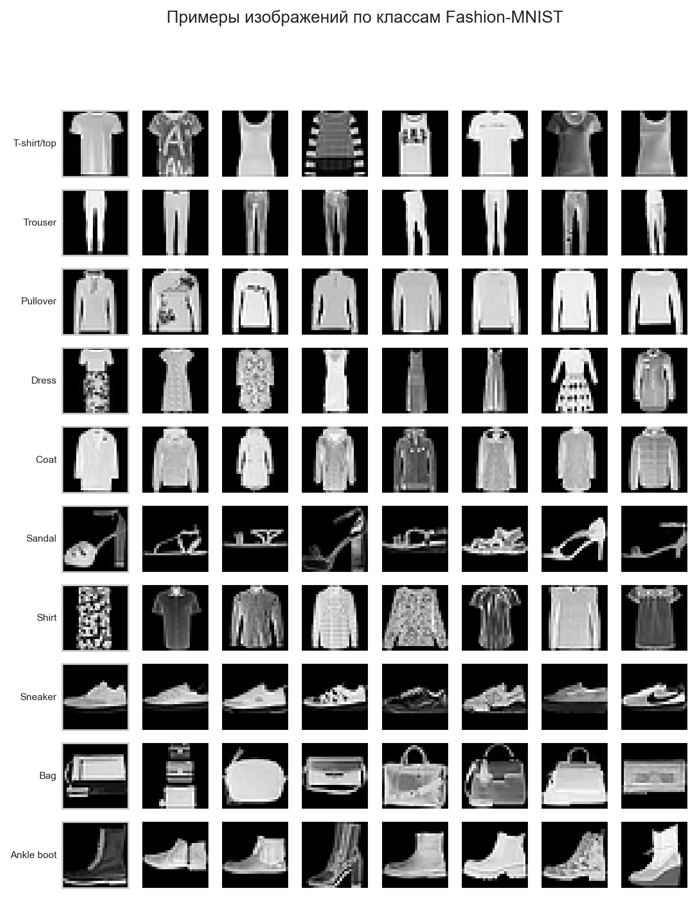

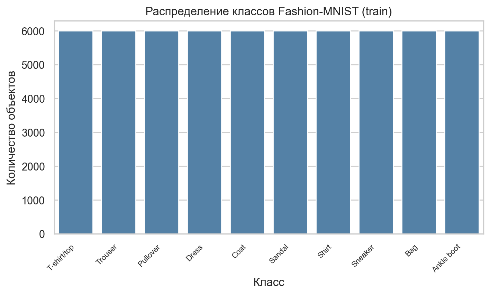

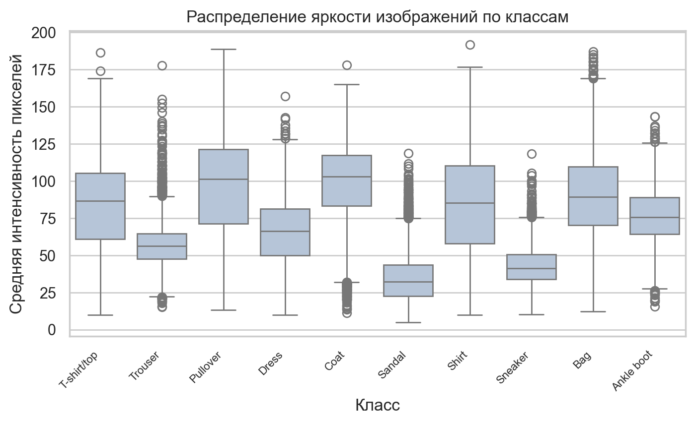

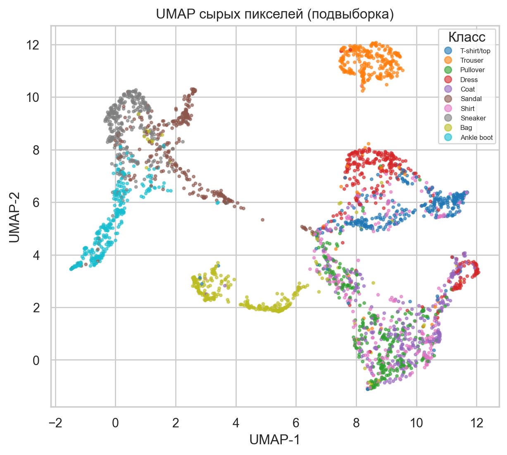

Ограничения представления (низкое разрешение, один канал, центрированные объекты
на чёрном фоне) и источники смещения описаны в `docs/data.md`: генератор наследует
смещения набора (позы, фон, частоты классов, смешение похожих классов «рубашка/
футболка/пуловер»).

# 2. Математическое описание центрального механизма архитектуры

**Состязательная игра.** GAN обучает генератор $G$ и дискриминатор $D$:

$$ \min_G \max_D \; \mathbb{E}_{x\sim p_{data}}[\log D(x)]
   + \mathbb{E}_{z\sim p_z}[\log(1 - D(G(z)))]. $$

При фиксированном $G$ оптимальный дискриминатор
$D^*(x) = p_{data}(x)/(p_{data}(x)+p_g(x))$ — то есть $D$ оценивает **отношение
плотностей** реальных и сгенерированных данных. Подстановка $D^*$ показывает, что
генератор минимизирует дивергенцию Йенсена–Шеннона:
$C(G) = 2\,\mathrm{JSD}(p_{data}\|p_g) - \log 4$, с минимумом при $p_g = p_{data}$.

**Несатурирующая потеря.** Исходная $\log(1-D(G(z)))$ насыщается на старте,
поэтому генератор максимизирует $\log D(G(z))$ (минимизирует $-\log D(G(z))$) —
сильный градиент в начале. Обе потери выражены через `BCEWithLogitsLoss` над
логитами: шаг $D$ — цели 1 (реальные, сглаживание до 0,9) и 0 (сгенерированные);
шаг $G$ — цель 1 для сгенерированных.

**Индуктивная гипотеза.** Данные лежат на многообразии малой размерности,
параметризуемом $z$; распределение задаётся неявно через сэмплирование
$x=G(z)$. Свёрточная структура обеих сетей вносит локальность и разделение весов,
что соответствует изображениям. Гипотеза нарушается при выраженной
мультимодальности: игра нестабильна, возможно **выпадение мод** (это проявляется в
сценарии дисбаланса). Подробный вывод — в `docs/theory_gan.md`.

# 3. Схема модели и параметры обучения

**Генератор (транспонированные свёртки).** Размер выхода транспонированной
свёртки: $H_{out} = (H_{in}-1)s - 2p + k$. Цепочка размерностей:
$z\in\mathbb{R}^{100} \to 7\times7\times(2\,g_{base}) \to 14\times14\times g_{base}
\to 28\times28\times1$; BatchNorm + ReLU в скрытых слоях, $\tanh$ на выходе.

**Дискриминатор (свёртки со страйдом).** $28\to14\to7\to1$; LeakyReLU(0,2), без
BatchNorm в первом слое, на выходе — логит. Предпоследняя активация используется
для интерпретации.

**Подбор ширины под бюджет CPU.** Замер показал: полная выборка 60 000 при
`g_base=d_base=64` даёт ~168 с/эпоху — слишком долго. Поэтому train сокращён до
30 000 объектов (стратифицированно, пропорции классов сохранены), а ширина
уменьшена до `g_base=d_base=48`; эпоха занимает ~52 с (в рамках бюджета
~60–75 с). Число параметров (собственная `summarize_model`) — в таблице 2.

Таблица 2 – Число обучаемых параметров моделей

| Модель | Параметров |
|---|---:|
| Генератор (g_base=48) | 545 329 |
| Дискриминатор (d_base=48) | 79 537 |
| Вспомогательный классификатор | 421 642 |

Дискриминатор легче генератора из-за структуры слоёв (большая часть параметров
генератора — в первой транспонированной свёртке $100\to2g_{base}$); ширина
выбрана из бюджета времени, а не из целевого числа параметров.

**Параметры обучения GAN:** оптимизатор Adam ($\beta_1{=}0{,}5$,
$\beta_2{=}0{,}999$), lr $2\cdot10^{-4}$; размер пакета 256; 18 эпох;
одностороннее сглаживание меток реальных до 0,9; на каждом шаге сначала
обновляется $D$, затем $G$; фиксированный набор $z$ для раскадровки прогресса;
латент $z\sim\mathcal{N}(0,I)$, $z\in\mathbb{R}^{100}$. Обучение — только на CPU
(Intel-Mac). Вспомогательный классификатор достигает точности **0,90** на тесте.

# 4. Базовые метрики и примеры результатов

Базовая DCGAN обучена 18 эпох (~52 с/эпоху). Кривые $D(x)$ и $D(G(z))$ сходятся к
устойчивому равновесию около 0,5–0,6 / 0,3–0,4 (рисунок 5) — признак здоровой
состязательной динамики без коллапса. Раскадровка фиксированного $z$ показывает,
как из шума формируется узнаваемая одежда (рисунок 6). Генерации базовой модели —
на рисунке 7.

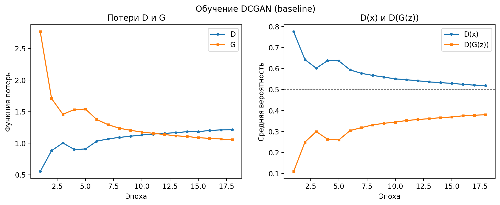

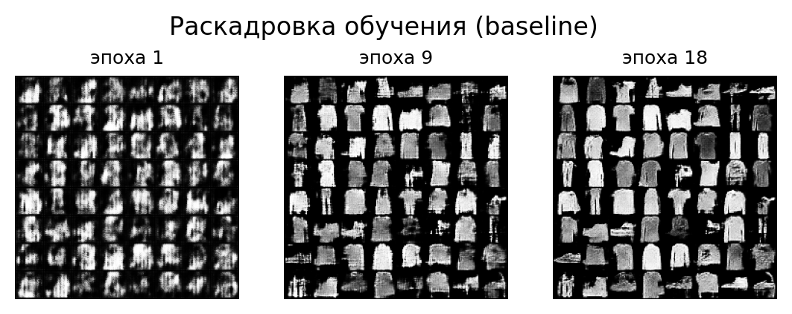

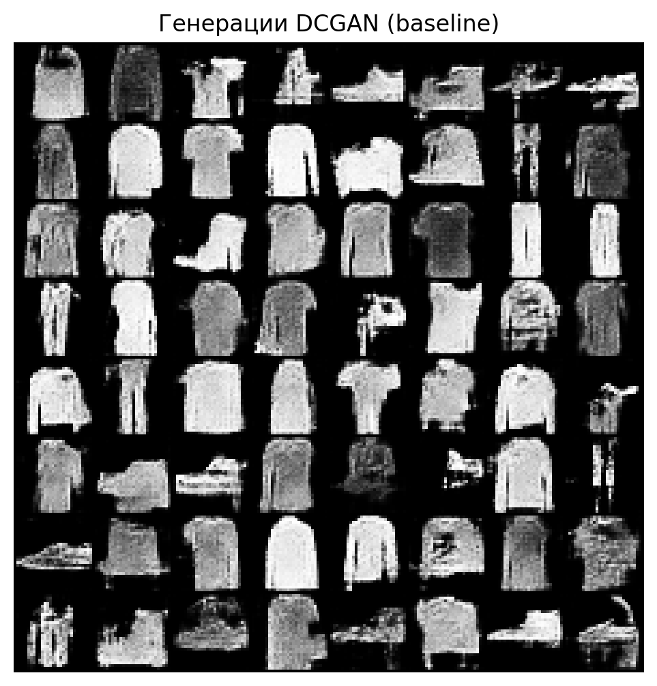

Метрики базовой модели на 10 000 генераций против теста (таблица 3, определения —
`docs/metrics.md`): domain-FID **39,5**; precision **0,44**, recall **0,57**;
JS-дивергенция классов **0,014**, выпавших классов **0**; средняя уверенность
классификатора **0,74** (> 0,6 — генерации читаемы). Проверка запоминания: медиана
расстояния генерация→train (5,4) **больше**, чем test→train (3,6), то есть
запоминания нет (рисунок 8). Типичные дефекты — размытые границы и смешение
близких классов (рубашка/футболка/пуловер); удачные и неудачные генерации — на
рисунках `part3_good_baseline.png` / `part3_bad_baseline.png`.

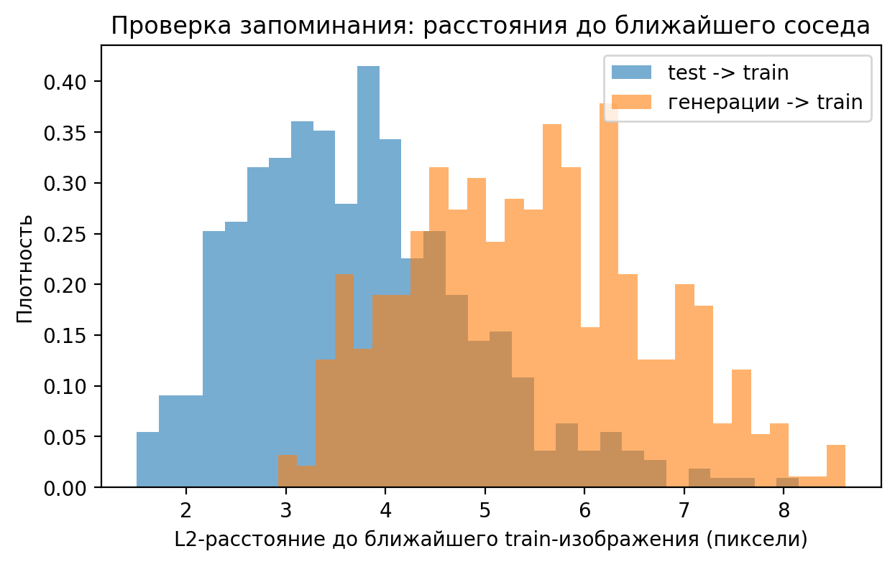

# 5. Сценарий нарушения данных (дисбаланс и отравление)

**Вариант A — искусственный дисбаланс (основной).** Из train удалены 95 % объектов
трёх классов — «сандалии» (5), «сумка» (8), «ботинки» (9); остальные без изменений
(21 450 объектов). GAN обучен в тех же условиях. Ожидание — выпадение мод: генератор
приближает $p_{data}$, поэтому редкие классы почти исчезают из генераций.

**Вариант B — отравление (дополнительный).** К доле $\epsilon\in\{5\%,20\%\}$
изображений класса «футболка» (0) добавлен триггер 4×4 (белый квадрат в углу).
Обучены две модели. Ожидание — генератор воспроизводит триггер как «признак
реальности»; доля таких генераций растёт с $\epsilon$. Детали — `docs/attacks.md`.

# 6. Сравнение результатов до и после нарушения

Сводные метрики всех моделей — в таблице 3 (`reports/tables/metrics_summary.csv`).

Таблица 3 – Метрики по сценариям (10 000 генераций против теста)

| Сценарий | domain-FID | precision | recall | JS классов | Выпавших | Ср. увер. | Доля с триггером |
|---|---:|---:|---:|---:|---:|---:|---:|
| базовая | 39,5 | 0,44 | 0,57 | 0,014 | 0 | 0,74 | — |
| дисбаланс | 116,9 | 0,49 | 0,35 | 0,079 | 1 | 0,73 | — |
| отравление ε=5 % | 38,1 | 0,43 | 0,58 | 0,009 | 0 | 0,74 | 0,000 |
| отравление ε=20 % | 41,7 | 0,43 | 0,57 | 0,008 | 0 | 0,74 | 0,021 |

**Дисбаланс.** domain-FID вырос втрое (39,5 → 116,9), **recall упал** 0,57 → 0,35
(потеря покрытия мод), тогда как **precision не упала** (0,44 → 0,49) — оставшиеся
генерации по-прежнему реалистичны. Это прямая иллюстрация замечания задания:
«общая реалистичность» может не ухудшиться, а покрытие редких классов рушится.
Per-class domain-FID подтверждает адресность эффекта: для удалённых классов он
резко вырос (класс 5: 120 → 204, класс 8: 138 → 218, класс 9: 142 → 356), тогда
как для нетронутых классов остался на уровне 55–88. Сравнение распределения классов
train→генерации — на рисунках 9–10.

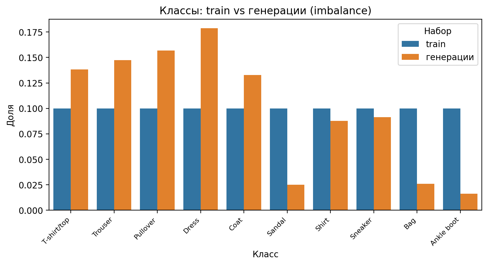

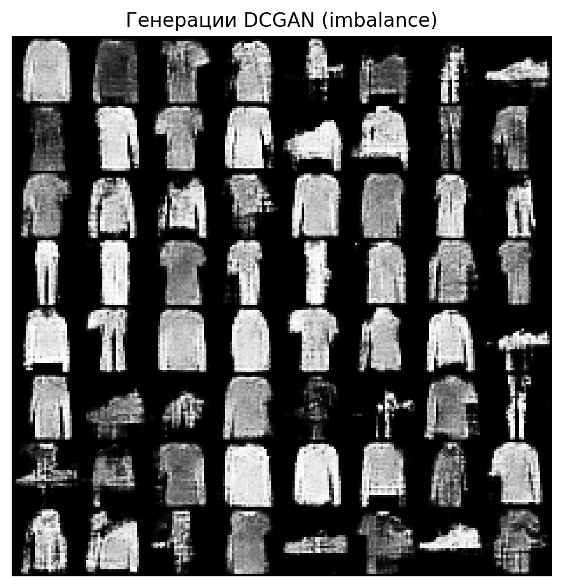

**Отравление.** При $\epsilon=5\%$ триггер в генерациях не появляется
(доля 0,000) — доля отравленных примеров слишком мала. При $\epsilon=20\%$
генератор воспроизводит триггер в **2,1 %** генераций (детектор по угловому патчу,
валидирован на train), при этом общие метрики качества почти не меняются
(domain-FID 41,7, precision/recall как у базовой). Вывод: генератор перенимает
устойчивый артефакт набора как «признак реальности», и эффект зависит от $\epsilon$
(рисунок 11).

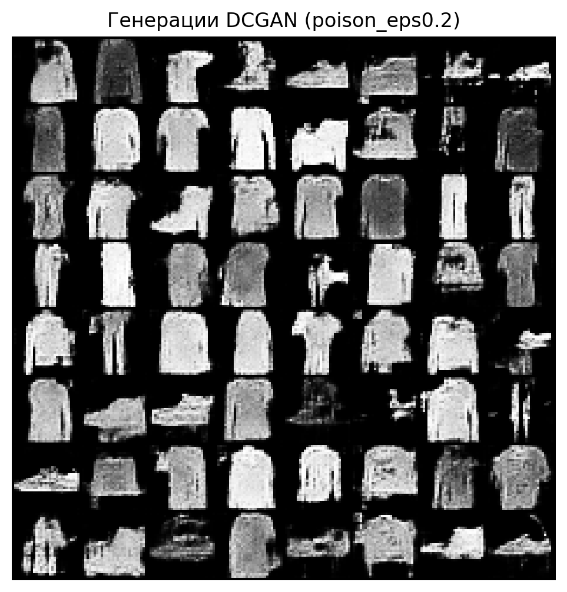

# 7. Визуализация скрытых слоёв и интерпретация решения

Использованы несколько содержательно разных методов, включая анализ скрытых
представлений (пункты 2 и 3).

**1. Латентное пространство генератора.** Сферические интерполяции (slerp) между
парами $z$ дают плавные переходы между объектами (рисунок 12) — латентное
пространство непрерывно и семантически осмысленно. Чувствительность генератора к
компонентам $z$ ($\|\partial G(z)/\partial z_i\|$) неравномерна: часть компонент
влияет на изображение сильнее (рисунок 13). У модели с дисбалансом интерполяции
беднее по разнообразию (выпавшие моды не появляются на траекториях).

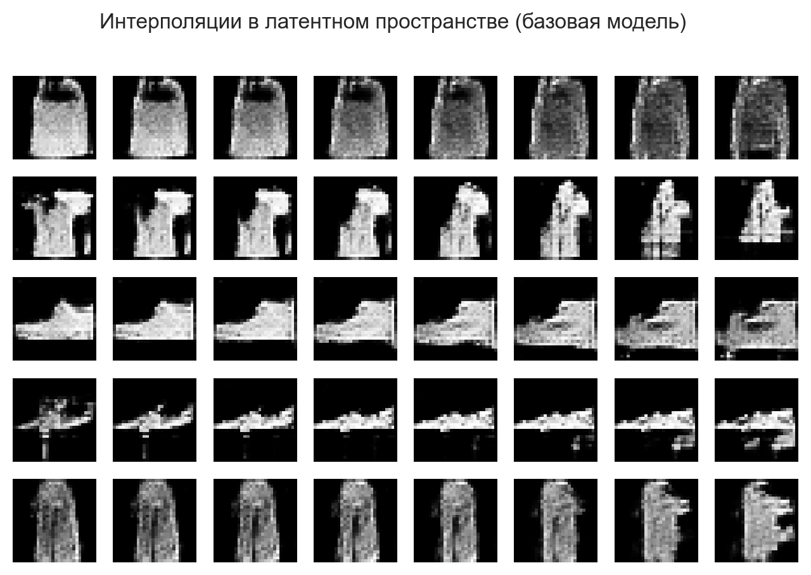

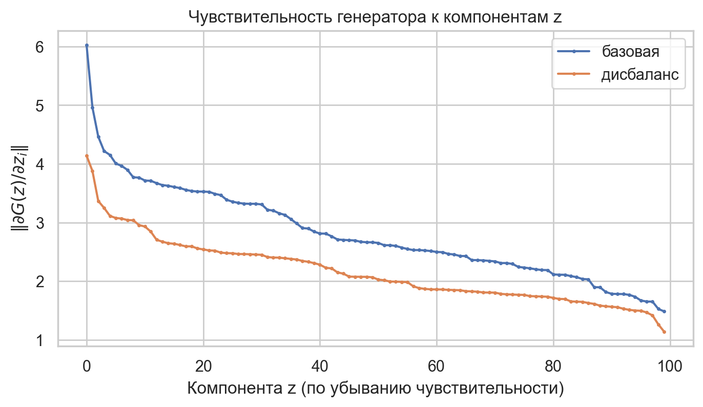

**2. Скрытые представления дискриминатора.** UMAP признаков предпоследнего слоя $D$
(рисунок 14) показывает, что реальные и сгенерированные объекты частично
разделяются; силуэт по классам мал (0,05) — $D$ обучен отличать реальное от
поддельного, а не классы. В отравленном сценарии триггерные изображения образуют
**отдельный кластер** в пространстве признаков отравленного $D$ (рисунок 15) — сеть
выделила артефакт как отдельный признак.

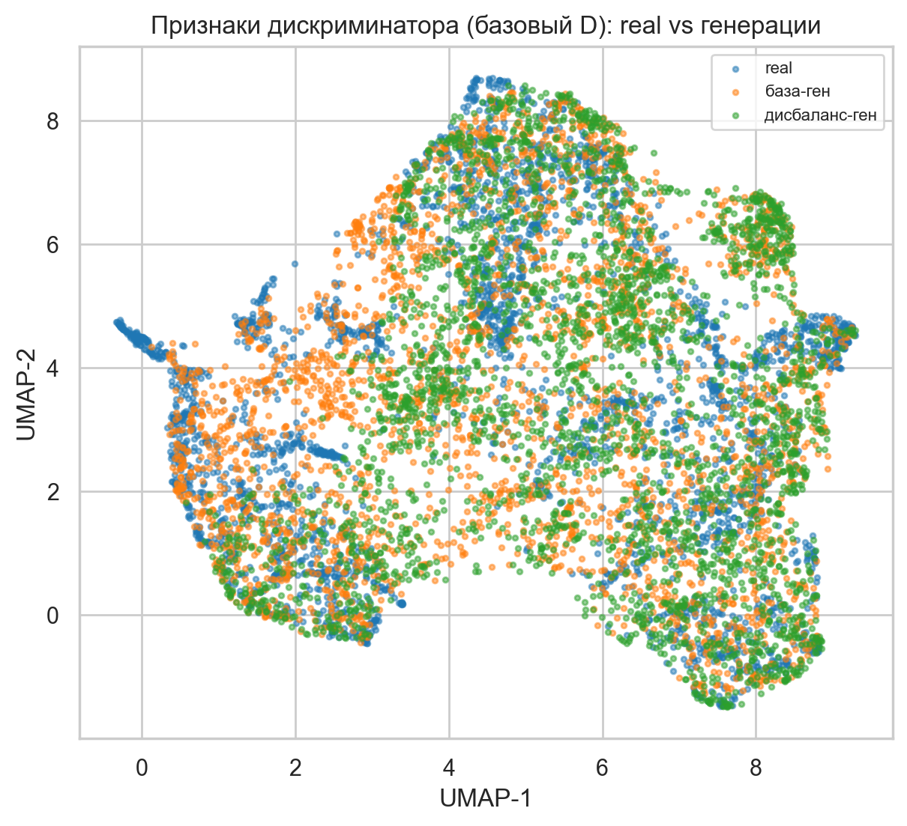

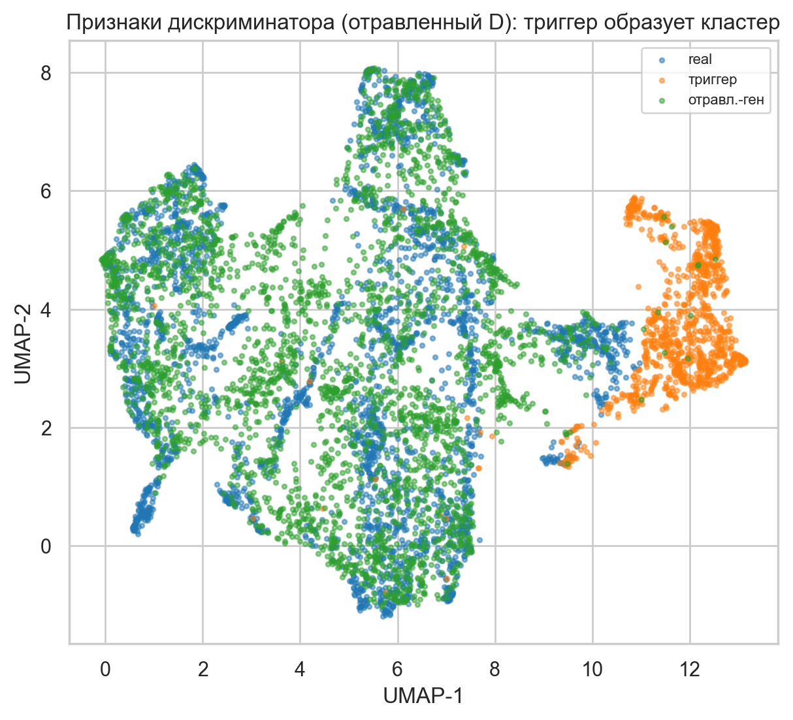

**3. Карты активаций генератора и фильтры дискриминатора.** Послойные активации
генератора показывают, как изображение формируется от 7×7 к 28×28 (рисунок 16);
фильтры первого слоя $D$ — локальные детекторы краёв и штрихов (рисунок 17).

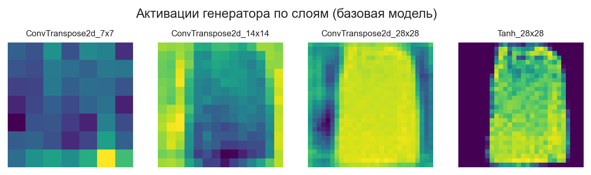

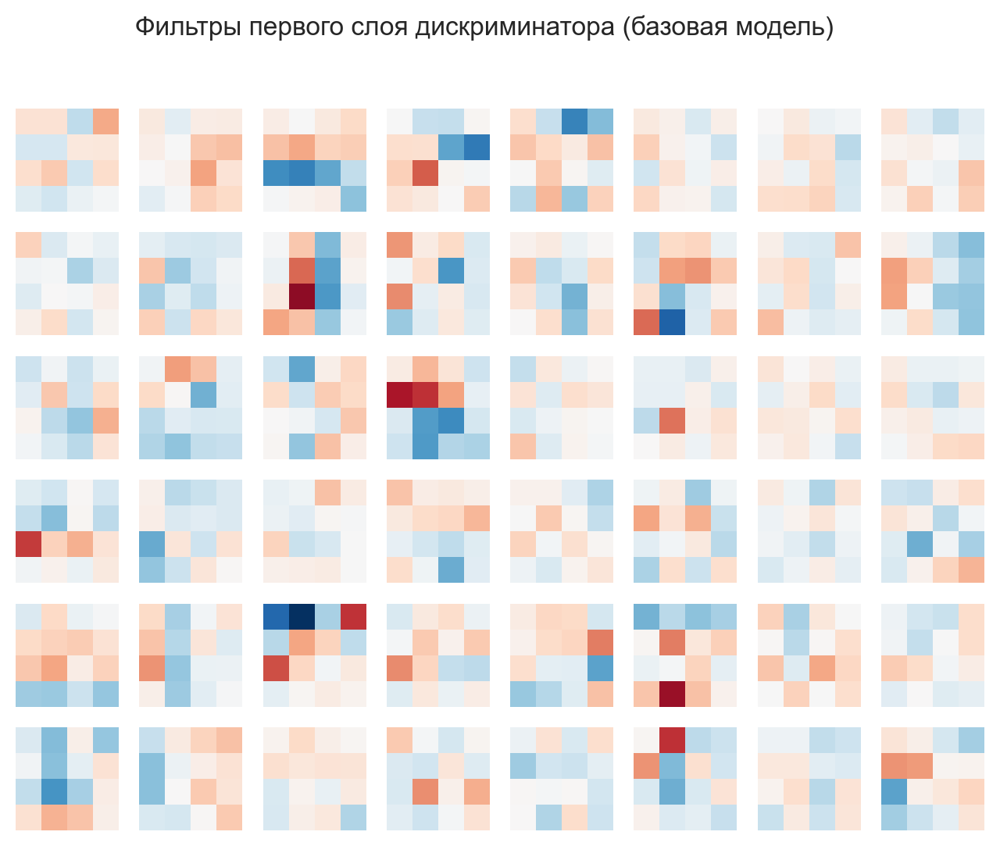

**4. Чувствительность дискриминатора.** Saliency, Grad-CAM и окклюзия окном 4×4
(по методичке ЛР3) показывают, какие области делают изображение «реальным» для $D$.
На триггерном изображении отравленный $D$ фокусируется на угловом квадрате
(рисунок 18) — триггер стал для него сильным признаком «реальности».

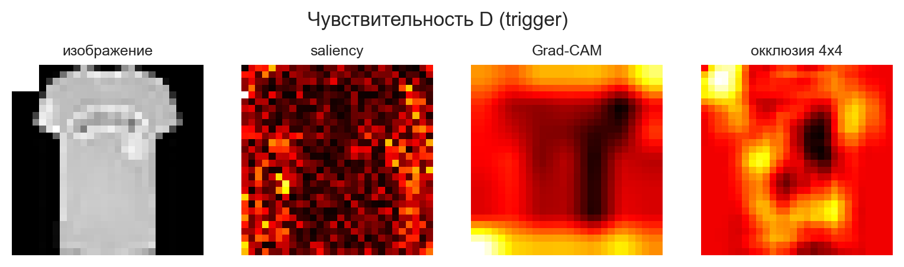

**5. Гистограммы весов и смещений** $D$ и $G$ (по методичке ЛР3) для базовой и
отравленной моделей приведены на рисунке 19; распределения весов близки к
нормальным, отравление слабо смещает распределение весов $D$.

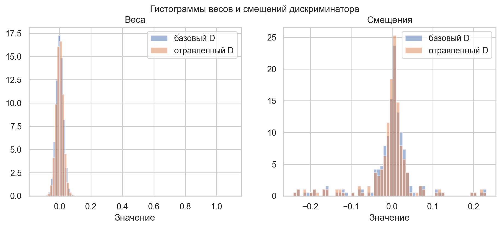

Ключевые объекты (удачная генерация; неудачная/низкоуверенная; редкий класс при
дисбалансе; генерация с триггером) собраны на рисунке 20.

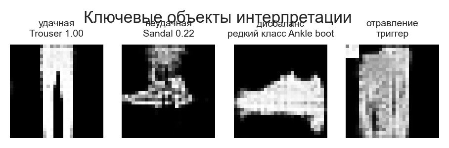

# 8. Итоговые выводы о применимости, ограничениях и устойчивости

- **Архитектура, задача, датасет.** Безусловный DCGAN моделирует распределение
  Fashion-MNIST через состязательную игру генератора и дискриминатора; свёрточная
  структура (локальность, разделение весов) — уместная индуктивная гипотеза для
  изображений.
- **Математическая идея.** Минимаксная игра; оптимальный дискриминатор оценивает
  отношение плотностей, генератор минимизирует дивергенцию Йенсена–Шеннона между
  $p_{data}$ и $p_g$; на практике — несатурирующая потеря через `BCEWithLogitsLoss`.
- **Базовое обучение.** domain-FID 39,5, precision 0,44, recall 0,57, средняя
  уверенность классификатора 0,74, признаков коллапса и запоминания нет; генерации —
  узнаваемая одежда.
- **Устойчивость к дисбалансу (Вариант A).** Проявляется **выпадение мод**: recall
  падает 0,57 → 0,35, domain-FID растёт до 116,9, per-class FID удалённых классов
  вырастает в 1,5–2,5 раза, при этом precision не падает. Общая «реалистичность» не
  отражает провал на редких классах — ключевой вывод.
- **Устойчивость к отравлению (Вариант B).** Генератор воспроизводит визуальный
  триггер как «признак реальности»; доля таких генераций растёт с $\epsilon$
  (0 % при 5 %, 2,1 % при 20 %) при почти неизменных общих метриках. Внутренне это
  видно по отдельному кластеру триггера в признаках $D$ и по фокусу Grad-CAM на
  артефакте.
- **Какие признаки использует модель.** Дискриминатор опирается на локальные
  штрихи/края (фильтры первого слоя) и на общую «реалистичность» объекта; при
  отравлении добавляется опора на триггер. Генератор кодирует объекты в непрерывном
  латентном пространстве, теряя редкие моды при дисбалансе.
- **Практические ограничения.** Низкое разрешение и один канал; безусловность (нет
  контроля класса); чувствительность к составу обучающего набора; на CPU обучение
  ограничено по ширине/объёму (подвыборка 30 000, `g_base=48`).
- **Меры повышения надёжности.** Балансировка и взвешенное сэмплирование редких
  классов; условная генерация (class-conditional GAN); фильтрация артефактов и
  контроль качества данных; регуляризация дискриминатора; мониторинг покрытия мод
  (recall) и распределения классов; детекция триггеров.
- **Вердикт валидации.** Базовая модель пригодна как демонстрационный генератор
  Fashion-MNIST; для применения на данных сомнительного происхождения — непригодна
  без контроля дисбаланса и проверки на отравление (см. паспорт модели).

# Список литературы

1. Попов И. Ю., Бучаев А. Я., Есипов Д. А. Валидация систем искусственного
   интеллекта: Лабораторный практикум. — СПб: Университет ИТМО, 2024.
2. Goodfellow I. et al. Generative Adversarial Networks. NeurIPS, 2014.
3. Radford A., Metz L., Chintala S. Unsupervised Representation Learning with Deep
   Convolutional GANs (DCGAN). ICLR, 2016.
4. Heusel M. et al. GANs Trained by a Two Time-Scale Update Rule Converge to a Local
   Nash Equilibrium (FID). NeurIPS, 2017.
5. Kynkäänniemi T. et al. Improved Precision and Recall Metric for Assessing
   Generative Models. NeurIPS, 2019.
6. Gu T., Dolan-Gavitt B., Garg S. BadNets: Identifying Vulnerabilities in the
   Machine Learning Model Supply Chain, 2017.
7. Selvaraju R. R. et al. Grad-CAM: Visual Explanations from Deep Networks. ICCV, 2017.
8. Arjovsky M., Bottou L. Towards Principled Methods for Training GANs. ICLR, 2017.
